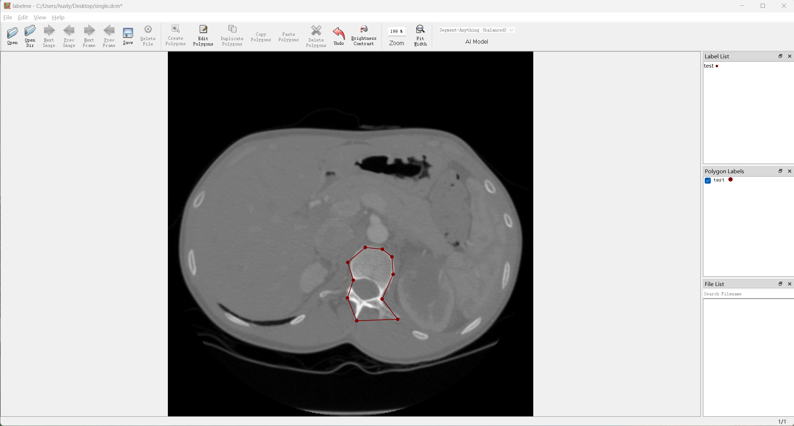

<h1 align="center">
  <br/>medical-labelme
</h1>

<h4 align="center">
  Medical image Polygonal Annotation with Python
</h4>

<div align="center">
  
</div>

## Description

medical-labelme is a graphical image annotation tool inspired by <http://labelme.csail.mit.edu>.

It is written in Python and uses Qt for its graphical interface.


## Features
- [x] DICOM image annotation, includes single-frame and multi-frame images
- [x] Image annotation for polygon, rectangle, circle, line and point. ([tutorial](examples/tutorial))
- [x] Image flag annotation for classification and cleaning.
- [x] Video annotation. ([video annotation](examples/video_annotation))
- [x] GUI customization (predefined labels / flags, auto-saving, label validation, etc).
- [x] Exporting VOC-format dataset for semantic/instance segmentation. ([semantic segmentation](examples/semantic_segmentation), [instance segmentation](examples/instance_segmentation))
- [x] Exporting COCO-format dataset for instance segmentation. ([instance segmentation](examples/instance_segmentation))


## Installation
Install standalone executable/app from:
https://github.com/hustyichi/medical-labelme/releases


### How to build standalone executable

Below shows how to build the standalone executable on macOS, Linux and Windows.

```bash
# Setup conda
conda create --name medical-labelme python=3.9
conda activate medical-labelme

# Build the standalone executable
pip install .
pip install 'matplotlib<3.3'
pip install pyinstaller
pyinstaller labelme.spec
dist/labelme --version
```


### How to contribute

Make sure below test passes on your environment.
See `.github/workflows/ci.yml` for more detail.

```bash
pip install -r requirements-dev.txt

flake8 .
black --line-length 79 --check labelme/
MPLBACKEND='agg' pytest -vsx tests/
```


## Acknowledgement

This repo is the fork of [wkentaro/labelme](https://github.com/wkentaro/labelme).
